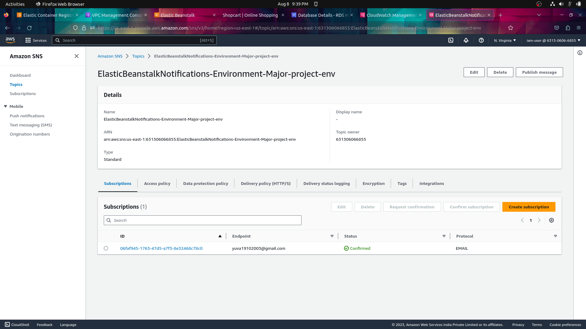

# full-stack-ecommerce-website-deployment-monitoring
Devloped an Full stack E-commerce Website using  python Django framework for database using the MYSQL from the AWS RDS. then containerised into an Docker image using docker file and pushed in AWS ECR .Deploying the AWS ECR image in the AWS EBS  in the Docker Platform using the dockerrun.aws.json and monitoring using cloudwatch and AWS SNS.


# Deploying a Full Stack E-commerce Django Website on AWS Elastic Beanstalk with CloudWatch Monitoring and SNS

This guide extends the previous instructions for deploying a full-stack E-commerce Django website on AWS Elastic Beanstalk using AWS Elastic Container Registry (ECR) by adding CloudWatch monitoring and Simple Notification Service (SNS) for alerting.

## Prerequisites

- AWS Account: You need an AWS account to access Elastic Beanstalk, ECR, CloudWatch, and SNS.
- Docker: Install Docker to create and manage containers.
- AWS Command Line Interface (CLI): Install the AWS CLI to interact with AWS services from the command line.
- Basic knowledge of Django and web development.

## Steps
1. **Develop the django website with MYSQL database**

  
  

   connecting the AWS RDS (MYSQL) to the Django Framework.
   
   IN settings.py
```bash
DATABASES = {
    'default': {
        'ENGINE': 'django.db.backends.mysql',  # For MySQL
        'NAME': 'shopcart',
        'USER': 'admin',
        'PASSWORD': '*********',
        'HOST': 'database-1.c9kx1gm7ufrm.us-east-1.rds.amazonaws.com',
        'PORT': '3306',
    }
}

```
      
2. **Containerize Your Django Application**

    Follow the steps from the previous guide to containerize your Django application using Docker.
   Using dockerfile
   ```bash
     # Use an official Python runtime as a parent image
     FROM python:3.9-buster

    # Set environment variables for Django
    ENV PYTHONDONTWRITEBYTECODE 1
      ENV PYTHONUNBUFFERED 1
  
    # Create and set the working directory
     WORKDIR /app

    # Copy the requirements file into the container at /app
    COPY requirements.txt /app/

    # Install any needed packages specified in requirements.txt
    RUN pip install --no-cache-dir -r requirements.txt

    # Copy the current directory contents into the container at /app
    COPY . /app/

    # Expose the port the app runs on
    EXPOSE 8000

    # Run the Django development server
     CMD ["python", "manage.py", "runserver", "0.0.0.0:8000"]
   ```
   

4. **Build and Push Docker Image to AWS ECR**

     


    Follow the steps from the previous guide to build and push the Docker image to AWS ECR.

6. **Deploy on Elastic Beanstalk**
   deploying the docker image using the dockerrun.aws.json file
   ```bash
   {
    "AWSEBDockerrunVersion": "1",
    "Image": {
        "Name": "public.ecr.aws/f4q0a7b5/website:latest"
    },
    "Ports":[{
        "ContainerPort": 8000,
        "HostPort": 8000
    }]

   }
   ```

   deploying in AWS EBS
    
    monitoring in AWS EBS
    
    Follow the steps from the previous guide to create an Elastic Beanstalk environment and deploy your Django application.

8. **Set Up CloudWatch Monitoring**
    
    - Open the AWS Management Console and navigate to the CloudWatch service.
    - Create CloudWatch Alarms:
      - Create alarms to monitor key metrics of your application, such as CPU utilization, memory utilization, and HTTP response times.
      - Configure the alarms to trigger when specific thresholds are breached.
      - Set up actions for the alarms to notify you via SNS.

9. **Configure Simple Notification Service (SNS)**
      
    - Open the AWS Management Console and navigate to the SNS service.
    - Create a Topic:
      - Create an SNS topic to receive notifications from CloudWatch alarms.
      - Configure the topic settings and subscriptions.

11. **Associate CloudWatch Alarms with SNS**
    
    - Go back to the CloudWatch service.
    - In the Alarms section, select an alarm.
    - Choose "Actions" and then "Modify Alarm" to configure the actions for the alarm.
    - Add a new action and select the SNS topic you created.
    - Save the changes.

12. **Test the Setup**

    - Introduce load to your Django application (e.g., simulate heavy traffic or high CPU utilization).
    - Wait for CloudWatch alarms to trigger based on the thresholds you set.
    - Receive notifications via SNS when alarms are triggered.

13. **Access Your Django Application**

    

    Once the deployment is complete, you'll be provided with a URL where your Django application is accessible.

## Conclusion

By following this guide, you have successfully deployed your full-stack Django website on AWS Elastic Beanstalk using AWS ECR, and you have set up CloudWatch monitoring and SNS for alerting. This enhanced setup allows you to closely monitor the performance and health of your application and receive timely notifications in case of any issues.
